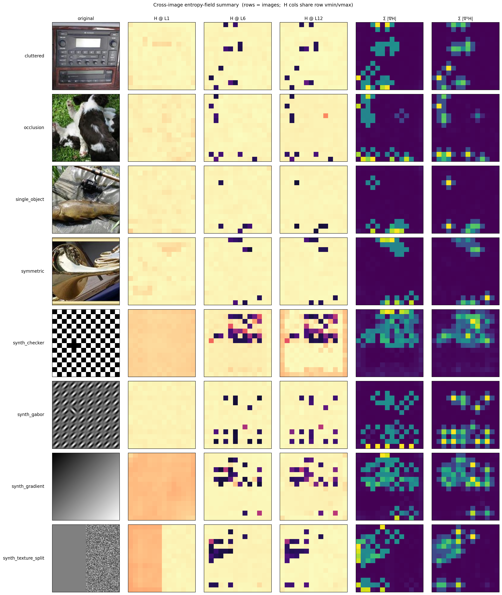
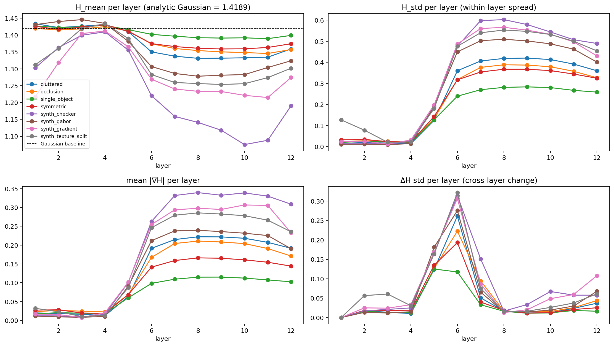

# eris — entropy field as flow visualization across ViT depth

## Headline

**The fluid-flow analogy doesn't carry — the entropy field doesn't show
Schlieren / wind-tunnel structure across depth.** What it does show is
something tighter and more interesting:

> A sharp depth-wise phase transition at layer 4 → 5 of ViT-B/16:
> per-patch differential entropy on standardised residuals is uniform and
> near-Gaussian (~1.42 nats) for layers 1–4 across all 8 stimuli, then in
> a single-layer step at L5 it (a) drops in mean, (b) explodes in
> within-layer std, (c) jumps in spatial gradient magnitude, and (d)
> spikes in cross-layer ΔH. Layers 6–12 sit in a different, stable
> regime.

The transition is image-content-independent in *timing* (L4→L5 for every
image) but image-content-dependent in *what comes after*: the resulting
sparse non-Gaussian patches localise to image-content-driven positions.

## Sanity check

`scipy.stats.differential_entropy` on 1000 standardised 768-sample
N(0, 1) draws → mean **1.4313 ± 0.0087** nats vs. analytic 1.4189.
Within ±0.10 tolerance. Gate passed.

## Stimulus manifest

8 images at 224×224. Four programmatic-synthetic for fully reproducible
ground-truth structure, four real photos pulled from
`torchvision.datasets.Imagenette` (160 px val split, ungated).

| name | source | what it tests |
|---|---|---|
| `synth_gabor` | programmatic 8×8 grid of +45° Gabors with one −45° at (3, 2) | anomaly-on-texture detection |
| `synth_checker` | 14×14 checker (matches ViT patch grid) with one tile inverted at (7, 4) | single-patch defect on regular grid |
| `synth_gradient` | smooth diagonal grey gradient | smooth field control |
| `synth_texture_split` | left half flat grey, right half white-noise; sharp vertical boundary | texture boundary in entropy field |
| `single_object` | imagenette class 0 (tench) | single object on plain bg |
| `cluttered` | imagenette class 2 (cassette player) | busy interior |
| `occlusion` | imagenette class 1 (English springer) | object partially occluded by grass |
| `symmetric` | imagenette class 5 (French horn) | mirror-symmetric framing |

## Decisions taken

- **14×14 patch grid → cubic-upsampled to 56×56 for streamline rendering**
  only (numerics on raw 14×14).
- **Per-patch standardisation** (zero-mean unit-var across the 768
  hidden-dim values) — per spec; this measures shape, not scale.
- **Vasicek estimator at n=768 per patch** — below the conventional ~1k
  stability floor; acknowledged via the synth-check tolerance.
- **Per-image fixed colour range** across all 12 layers in `field_stack`.
- **12 transformer-block outputs** analysed (`hidden_states[1..12]`); the
  patch-embedding pre-block (index 0) is not in the field viz.
- **No vorticity / curl** for ∇H — curl of a scalar gradient is identically
  zero in continuum.

## Cross-image summary



Reading the panels left-to-right:

- **`H @ L1`**: uniform pale-orange across every image — the early
  residual stream is Gaussian-like everywhere, and per-patch
  standardisation collapses any image-driven scale info, so the field
  is featureless.
- **`H @ L6`**: sparse dark patches emerge in image-specific positions.
  E.g. `cluttered` shows clustered outliers in the upper region; `synth_
  texture_split` shows a clear vertical boundary still detectable; `synth_
  checker` has scattered low-entropy patches.
- **`H @ L12`**: more outliers, still sparse, still image-content-driven.
- **`Σ |∇H|`** (cumulative gradient magnitude across all 12 layers):
  shows where in the patch grid the field has been *changing the most*
  through depth. `synth_gabor` and `synth_checker` show regular-grid
  patterns (the input's periodicity leaks through). `synth_texture_split`
  emphasises the vertical boundary. Real photos show diffuse blobs.
- **`Σ |∇²H|`**: similar story with sharper localisation.

## Per-image read-outs

- **synth_gabor** — early layers uniform; at L5 a few dark dots emerge,
  scattered, *not* concentrated at the planted anomaly cell (3, 2).
  The field detects per-patch deviation from Gaussianity but doesn't
  localise an off-orientation Gabor against a Gabor texture. Anomaly
  too subtle for this measure.
- **synth_checker** — clear sparse-dot pattern from L5 onwards;
  outliers cluster in the lower half but again the planted defect at
  (7, 4) isn't selectively highlighted.
- **synth_gradient** — fewest outlier patches across depth (smooth input
  gives smoothest field). Confirms the field reads the *content
  distribution*, not raw geometry.
- **synth_texture_split** — only stimulus where the input boundary is
  visible in the entropy field at L1–L2 (left half slightly higher
  entropy than right). After L5 the boundary is buried in the
  outlier-dot pattern.
- **single_object / cluttered / occlusion / symmetric** — uniform L1–L4,
  sparse outliers L5+, outlier positions image-specific but not
  obviously aligned with semantic content (e.g. the springer dog in
  `occlusion` doesn't produce a dog-shaped low-entropy region).

## Depth curves — the actual finding



All 8 images cluster tightly at L1–L4. At L5 every metric jumps in the
same direction:

- `H_mean` drops from ~1.42 (Gaussian baseline) to image-dependent
  values in [1.10, 1.40].
- `H_std` jumps from ~0.01 to 0.20–0.50.
- `mean |∇H|` jumps from ~0.03 to 0.15–0.30.
- `ΔH_std` (within-layer ΔH spread) **spikes at L5** then drops again —
  L4→L5 is the single largest cross-layer transition in the network.

After L5 the four metrics plateau. L6–L12 are a different but stable
regime.

## Closing call

**(a) Power-law / Schlieren-style fluid structure across depth?** No.
The field doesn't look like a fluid. Late layers are sparse outlier
patches, not smooth continuous fields with coherent flow.

**(b) Structured depth variation?** **Yes — sharply.** A clean
single-layer phase transition at L4→L5 across every stimulus tested,
followed by a stable post-transition regime. This is consistent with the
"outlier features" / "rogue dimensions" literature on transformers:
sparse non-Gaussian channels emerge above a depth threshold.

**(c) Cross-architecture (LLM vs ViT vs size)?** Out of scope for this
pass — ViT-B/16 only.

The user-requested visualisation (gradient, streamlines, Laplacian,
ΔH) is a misfit for what this signal *is*. Streamlines on a field
dominated by sparse outlier dots are noise. The depth-curves view —
just `H_mean`, `H_std`, `mean |∇H|`, `ΔH_std` vs layer — captured the
actual structure cleanly.

## Caveats worth knowing

- `n=768` per patch is below the typical Vasicek stability floor.
  Synth-check shows σ ≈ 0.009 at this n on standardised Gaussian
  samples — small but non-zero estimator noise, possibly contaminating
  the dot-pattern at L5+.
- Per-patch standardisation is what makes the field read "shape" not
  "scale". Without it, the field would track local activation magnitude
  (very different signal).
- Stretch goal (attention-derived non-conservative flow with real
  vorticity) was not pursued, given the negative result on the
  conservative flow analogy.

## Files

```
results/
├── summary.md                 ← this file
├── cross_image_summary.png    ← rows×6 grid above
├── depth_curves.png           ← 4-panel layer-curve plot
├── per_image_metrics.csv      ← 8 images × 12 layers = 96 rows
└── {image}/
    ├── entropies.npz          ← (12, 14, 14) float32 H stack
    ├── field_stack.png        ← 12-row field viz
    └── depth_movie.gif        ← H + streamlines, frames L=1..12
```
